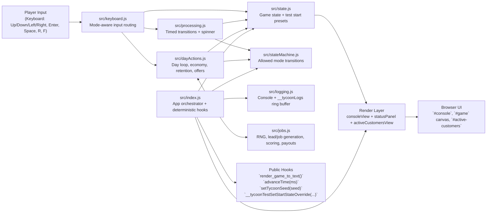
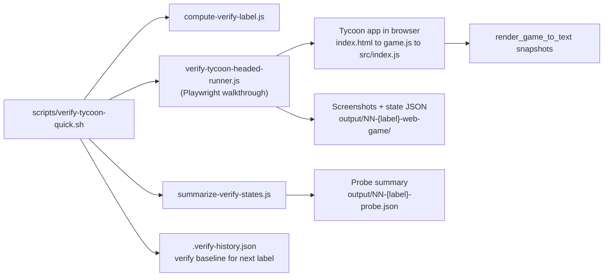

# Tycoon POC System Design

## Runtime Architecture

## Verification Pipeline

## Notes

- `src/index.js` is the composition root: initializes seeded state, attaches keyboard handlers, and drives rendering.
- Mode safety is centralized in `src/stateMachine.js`, while transition timing is mediated by `src/processing.js`.
- Economic outcomes and customer lifecycle behavior are concentrated in `src/dayActions.js` + `src/jobs.js`.
- Verification is deterministic by default because verify scripts append `?start_state=test_all_actions` unless overridden.
